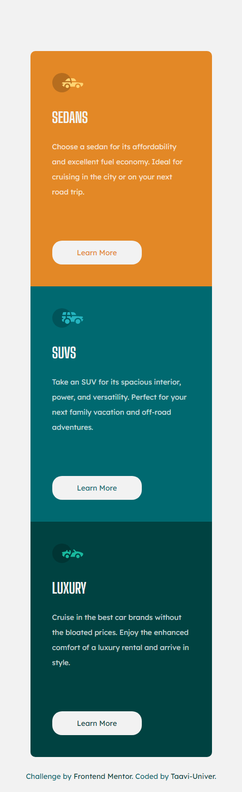
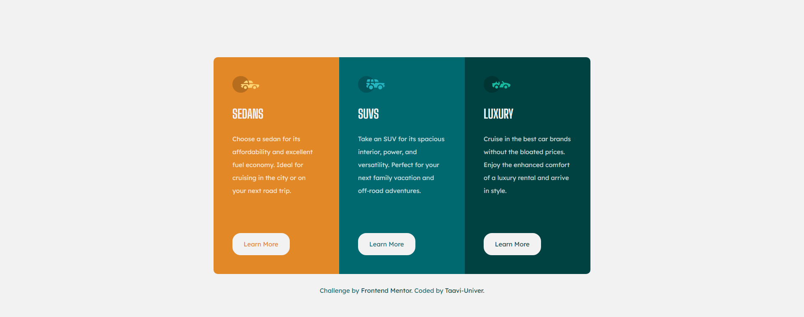

# Frontend Mentor - 3-column preview card component solution

This is a solution to the [3-column preview card component challenge on Frontend Mentor](https://www.frontendmentor.io/challenges/3column-preview-card-component-pH92eAR2-). Frontend Mentor challenges help you improve your coding skills by building realistic projects. 

### Screenshot

Mobile view:

Desktop view:

### Links

- Solution URL: https://www.frontendmentor.io/solutions/mobile-first-design-rQveoca9S
- Live Site URL: https://taavi-univer.github.io/3-column-preview-card-component/

## My process

### Built with

- Mobile-first workflow
- Flexbox

## Author

- Website - https://github.com/taavi-univer?tab=repositories
- Frontend Mentor - https://www.frontendmentor.io/profile/taavi-univer
